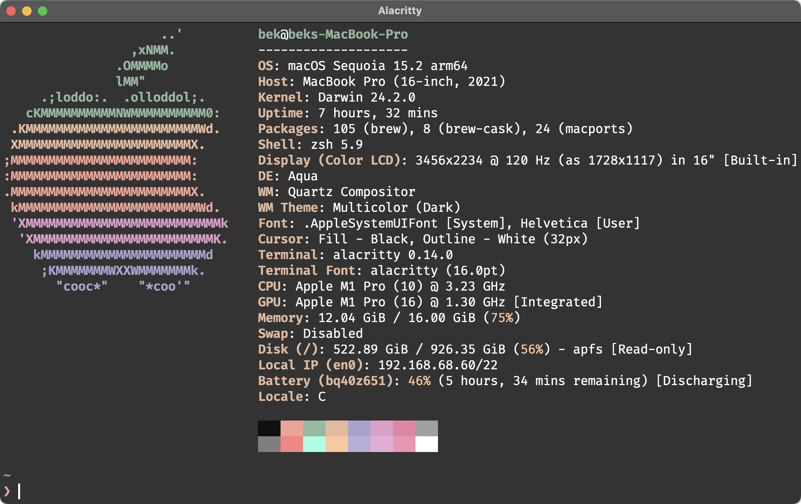

# dotfiles

Personal macOS (Apple Silicon) shell environment — zsh + oh-my-zsh + powerlevel10k, deployed with GNU Stow.

## Preview



## Layout

| Path | Purpose |
|------|---------|
| `.zshenv` | PATH for **all** shells — puts arm Homebrew first, even non-interactive |
| `.zshrc` | Interactive entry point: helpers → Homebrew → modules below |
| `.config/zsh/.helpers.zsh` | `__load` / `__add_to_path` / `__ensure_omz` bootstrap |
| `.config/zsh/.instant-prompt.zsh` | powerlevel10k instant prompt |
| `.config/zsh/.exports.zsh` | env vars (EDITOR, PAGER, XDG…) + interactive `setopt`s |
| `.config/zsh/.oh-my.zsh` | oh-my-zsh + p10k bootstrap (auto-installs if missing) |
| `.config/zsh/.omz-plugins.zsh` | oh-my-zsh plugin list |
| `.config/zsh/.history-settings.zsh` | history config + prefix-search keybinds |
| `.config/zsh/.completions.zsh` | fzf + zoxide integration |
| `.config/zsh/.tools.zsh` | language runtimes (Bun, lazy nvm, Go, Rust, Deno…) |
| `.config/zsh/.aliases.zsh` | aliases + small functions |
| `.config/alacritty/` | Alacritty config + themes |
| `.config/homebrew/Brewfile` | `brew bundle` manifest (formulae, casks, VS Code ext) |
| `.gitconfig`, `.p10k.zsh` | git + prompt config |

## Install

```sh
git clone <repo> ~/dotfiles
brew bundle --file=~/dotfiles/.config/homebrew/Brewfile
stow --dir="$HOME" --target="$HOME" dotfiles
```

## Notes

- **nvm is lazy-loaded** — the first `node`/`npm`/`npx`/`nvm` call sources it, keeping startup ~0.7s instead of ~1.5s. Primary JS runtime is Bun.
- Adding a zsh module: drop `.config/zsh/.<name>.zsh` and add a `__load '<name>'` line to `.zshrc` (the `.config/zsh` dir is stow-symlinked, so new files are picked up automatically).
