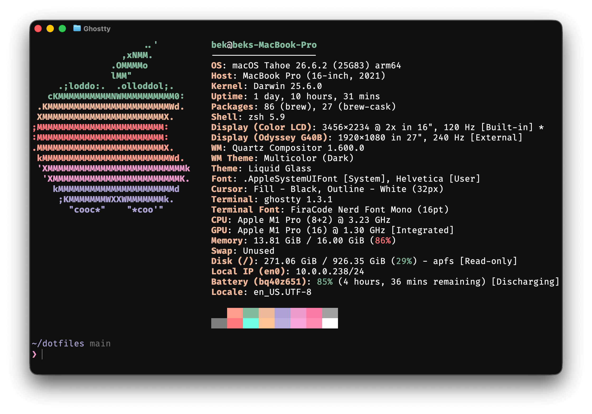

# dotfiles

Cross-platform (macOS + Linux) zsh environment — antidote + powerlevel10k, deployed with GNU Stow, packages via a single OS-guarded Brewfile.

## Preview



## Layout

| Path | Purpose |
|------|---------|
| `.zshenv` | ZDOTDIR, OS detection (`DOTFILES_OS`), Homebrew on PATH for all shells |
| `.config/zsh/.zshrc` | Entry: helpers → `<os>/entry.zsh` → `shared/entry.zsh` |
| `.config/zsh/shared/helpers.zsh` | `__load`, `__add_to_path`, `__eval_cached` |
| `.config/zsh/shared/entry.zsh` | Module chain: exports → antidote → history → keybinds → completions → tools → aliases |
| `.config/zsh/shared/antidote.zsh` | Plugin manager; static bundles from `.zsh_plugins*.txt`, zcompiled |
| `.config/zsh/shared/tools.zsh` | mise (cached), Go, cargo, deno, bun, Android, LM Studio paths |
| `.config/zsh/macos/` | ANDROID_HOME, Keychain-backed secrets |
| `.config/zsh/linux/` | ANDROID_HOME, libsecret-backed secrets, pbcopy/pbpaste shims |
| `.config/ghostty/` | Ghostty terminal config |
| `.config/homebrew/Brewfile` | One manifest: shared formulae + `if OS.mac?` casks/mas/vscode |
| `.gitconfig` | Signing, delta pager, fsmonitor, histogram/zdiff3 |
| `.gnupg/` | gpg-agent templates; install.sh writes the per-OS conf |

## Install

```sh
git clone <repo> ~/dotfiles
~/dotfiles/install.sh
```

The script installs Homebrew if missing, `stow`s the repo into `$HOME`, and runs `brew bundle`. Plugins install themselves on first shell start.

## Secrets

Registry tokens never live in files. `~/.npmrc` / `~/.bunfig.toml` reference env vars; the shell loads them lazily on the first `npm`/`npx`/`bun`/`bunx` call per session.

- macOS: `security add-generic-password -U -a "$USER" -s github-packages-token -w '<token>'`
- Linux: `secret-tool store --label=github-packages service github-packages-token`

Rotating a token = re-running the store command. Nothing else changes.

## Behavior notes

- Startup ≈ 60 ms: static antidote bundles, `compinit -C`, cached `brew shellenv` and `mise activate`, lazy Keychain reads.
- History expansion (`!!`), `nomatch` glob aborts, `=cmd` and interactive extended-glob are **off** — strings with `! ? ^ [ ] =` pass through literally. Matching globs still expand; `globdots` is on, so bare `*` includes dotfiles.
- History lives at `~/.local/state/zsh/history` (100k, deduped, shared).
- `eza`/`rg`/`fd`/`delta` replace ls/grep/find/diff-pager where installed, with plain fallbacks.
